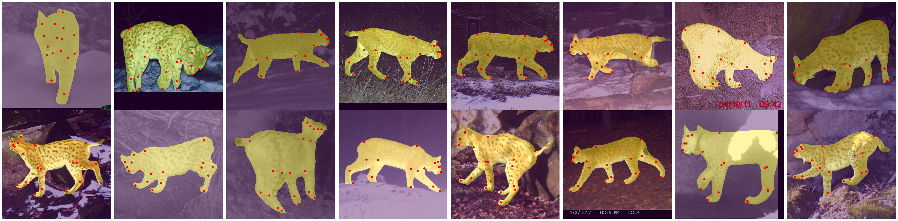

# CzechLynx ReID Demo

This is a Streamlit demo for an elementary-school activity about individual animal ReID. Students first match mystery lynx photos by eye, then the simulated "AI" reveal shows predefined answers with confidence-style scoring.



## Introduction

Wildlife is decreasing. And that's a probelm.

Individual recognition is really important part of conservation. Tagging the main one is really bad for the animal because it causes discomfort.

It is important  The lynx which is my subject of interest is also affected by these reasons. The AI works like the human face recognition.
 
I consulted a wildlife expert, and he actually agreed that AI can efficient and can be very useful if used ethically and correctly. 

I want to show with this that AI is better at Re-identifying then humans, and is better for the animal than tags.

## Why I want to do this

I want to do this because I like animals and AI so I wonderd how to merge the two of them together. I also really want to help animals so I thought wy not use AI. 

I got this idea about using AI to help animals from a famous conference, called CVPR, Computer Vision Pattern Recognising. 


## Run

```powershell
pip install -r requirements.txt
streamlit run app.py
```

## Customize the lynx IDs

Edit `data/lynx_demo.json`.

- Add each known individual under `identities`.
- Add each classroom mystery photo under `queries`.
- Set `correct_identity` to one of the identity IDs.
- Put your image files in `assets/` or use any path relative to this folder.
- The app randomly picks 3 mystery photos for each round.
- Each mystery photo gets 4 reference choices: the correct identity plus 3 distractors.
- Optional: add `reference_choices` to a query if you want to control which identities can appear as choices for that photo.

Example:

```json
{
  "id": "mystery_01",
  "label": "Mystery photo 1",
  "image": "assets/czechlynx/mystery_01.jpg",
  "correct_identity": "lynx_mira",
  "confidence": 97,
  "reference_choices": ["lynx_kora", "lynx_mira", "lynx_sava", "lynx_tibor"],
  "evidence": ["shoulder spots", "cheek stripe", "flank pattern"]
}
```

Click **New random round** in the sidebar to sample another set of 3 mystery photos.

